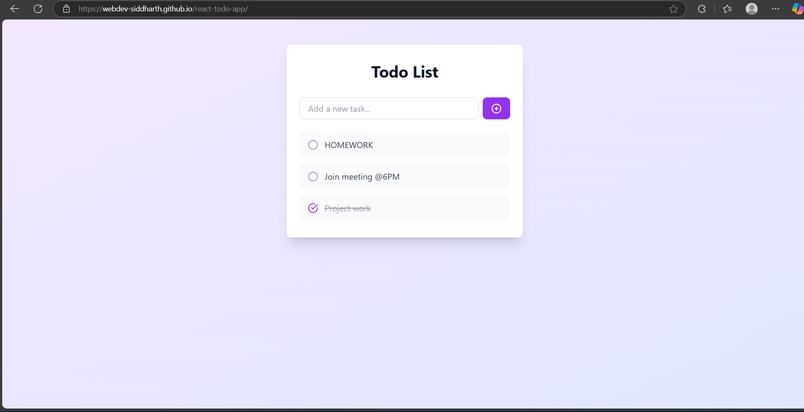

# 📝 React Todo App

A simple and interactive **Todo List** app built with **React**. Users can add, edit, delete, and mark tasks as completed. The app also saves tasks locally so they persist even after refreshing the page.


## 🚀 Features

- ✅ Add new tasks
- ✅ Mark tasks as completed or incomplete
- ✅ Edit existing tasks
- ✅ Delete tasks
- ✅ Tasks persist on page refresh using **localStorage**
- 💡 Built with **React** and **CSS**

## 📸 Screenshot

<!-- You can add a screenshot here -->


## 🌐 Live Demo

👉 [Click here to view the live app](https://webdev-siddharth.github.io/react-todo-app/)

## 🛠️ Tech Stack

- React (with Hooks)
- CSS (or Tailwind CSS if you're using it)
- localStorage for persistence

## 📁 Project Structure

```
react-todo-app/
├── public/
├── src/
│   ├── components/
│   ├── App.js
│   └── index.js
├── package.json
├── README.md
└── .gitignore
```

## 🧑‍💻 Getting Started Locally

```bash
# Clone the repo
git clone https://github.com/webdev-siddharth/react-todo-app.git

# Navigate into the project
cd react-todo-app

# Install dependencies
npm install

# Run the development server
npm start
```

## 📦 Deploy to GitHub Pages

```bash
npm run deploy
```


### 👨‍💻 Author

**Siddharth Vishwakarma**  
[LinkedIn](https://linkedin.com/in/mrsiddharthvishwakarma) • [GitHub](https://github.com/webdev-siddharth)
